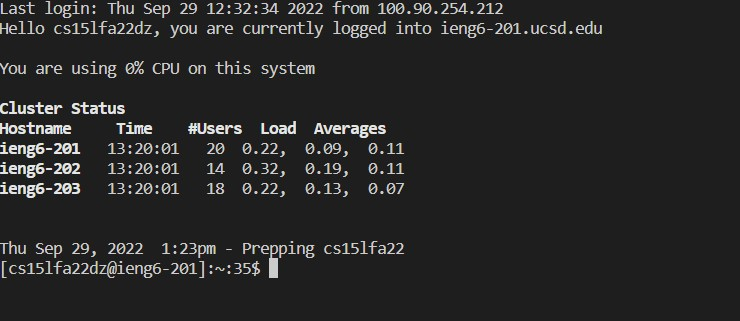
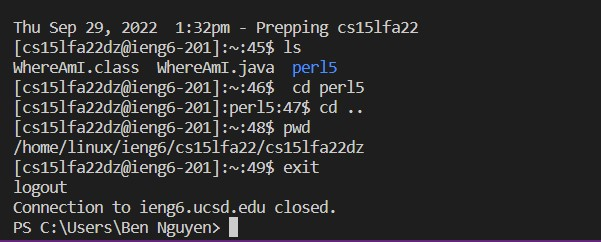
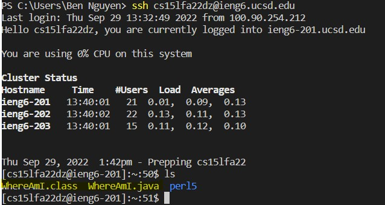
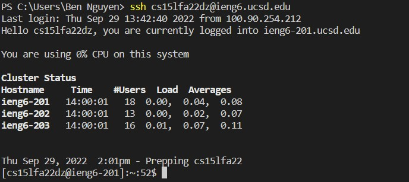
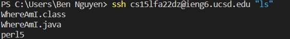
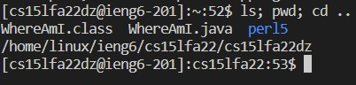
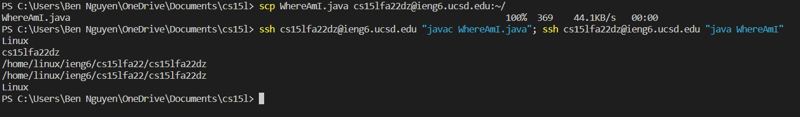

Week 1
# Lab 1: Remote Access
This lab was focused on creating an environment to work on tasks remotely through a remote server

## Part 1: Installing Visual Studio Vode
I downloaded and installed Visual Studio Code by clicking on this [link](https://code.visualstudio.com/).
Once VSCode was installed, I was able to open it up like the screenshot below.


## Part 2: Removetly Connecting
Since I was working on Windows, I had to install OpenSSH [here](https://learn.microsoft.com/en-us/windows-server/administration/openssh/openssh_install_firstuse?tabs=gui). Interestingly, nwhen installing this program, I noticed that I already had OpenSSHclient downloaded.

Afterwards, I opened a terminal on VSCode by clicking the **Terminal** tab on the top right cornor and clicking **New Terminal** on the drop down.
In the terminal, I entered the command:

`ssh cs15lfa22dz@ieng6.ucsd.edu`

When I logeed in for the first, I did not receive the prompt asking me to make sure I wanted to continue connecting to the server. Nonetheless, once I logged in, the terminal appeared similar to the following screenshot


## Part 3: Running Some Commands
On my terminal, I tried running some of the commands below:
- `cd <location>`
- `cd ..`
- `ls`
-  `ls -a`
- `pwd`

The below screenshot shows the results of some of the commands above


## Part 4: Moving Fles over SSH with scp
In order to move files over from my local device onto my account, I first created a WhereAmI.java file

```
class WhereAmI {
  public static void main(String[] args) {
    System.out.println(System.getProperty("os.name"));
    System.out.println(System.getProperty("user.name"));
    System.out.println(System.getProperty("user.home"));
    System.out.println(System.getProperty("user.dir"));
  }
}
```
Once this file was created, I copied the file over onto the server with the following command:

`scp WhereAmI.java cs15fla22dz@ieng6.ucsd.edu:~/`

After entering the command, I was prompted to enter my password for my `ieng6` account. After successfully copying over the file to my account, I logged onto the account to check if the file was there by entering the command `ls`. The following screenshot displays the result of the command (the `ls` command also shows the the `javac` file since I compiled the file):



## Part 5: SSH Keys
The SSH Keys process was the most difficult of the lab in my opinion. I used the `ssh-keygen` command to create my public and private key.
I was prompted withe following prompt

`Enter file in which to save the key (/Users/Ben Nguyen/.ssh/id_rsa):` 

I pressed `enter` in response to the prompt to choose the default path. I also pressed `enter` when choosing my passphrase. Since I was on a Windows device, I followed the extra `ssh-add` steps from this [link](https://learn.microsoft.com/en-us/windows-server/administration/openssh/openssh_keymanagement#user-key-generation). However, I am  unsure if this step was necessary as the keys created by it were not used.

The original `ssh-keygen` command created both the necessary private key (`id_rsa`) and public key (`id_rsa.pub`) that I needed. Both were stored in the `.ssh` directory of my device. I performed the following in an attempt to copy over my public key:

```
# On Personal Device
ssh cs15lfa22dz@ieng6.ucsd.edu
<Enter Password>
```

```
# On Server Account
mkdir .ssh
exit
```

```
# On Personal Device
scp /Users/Ben Nguyen/.ssh/id_rsa.pub cs15lfa22dz@ieng6.ucsd.edu:~/.ssh/authorized_keys
```
The `scp` command did not work for some reason as it seemed  one of my directories had a space in the name (`Ben Nguyen`) that prevented the command from going through, the comamnd would not work. This was eventually resolved when my TA advised me to change to the directory above the `.ssh` directory where the keys were located so that I could perform the command without having to type the directory. This was the resulting command that I used

`scp id_rsa.pub cs15lfa22dz@ieng6.ucsd.edu:~/.ssh/authorized_keys`

Once I eventually copied over the public key, I was then able to log into my account without a password. The example below shows me logging into my account with an empty passphrase (no password):



The process of logging into the account was indeed much easier now that I didn't need to enter my password.

## Part 6: Simplifying Remote Running
I used the following tips to try to edit my `WhereAmI.java` file,copy it over to my server account, and run it in 10 key strikes or less
- Running a command directly on my `ssh` account on my local device by typing the command in quotes:
    `ssh cs15lfa22dz@ieng6.ucsd.edu "ls"
    
- Runnign multiple commands at once using semicolons:
    `ls; pwd; cd ..`
    
- Recalling previous commands by pressing the up-arrow key

I found that using the up-arrow key in combination with running multiple commands with the semicolon was extremely helpful in letting me edit, copy over a file to my `@ieng6` account, and running that file



