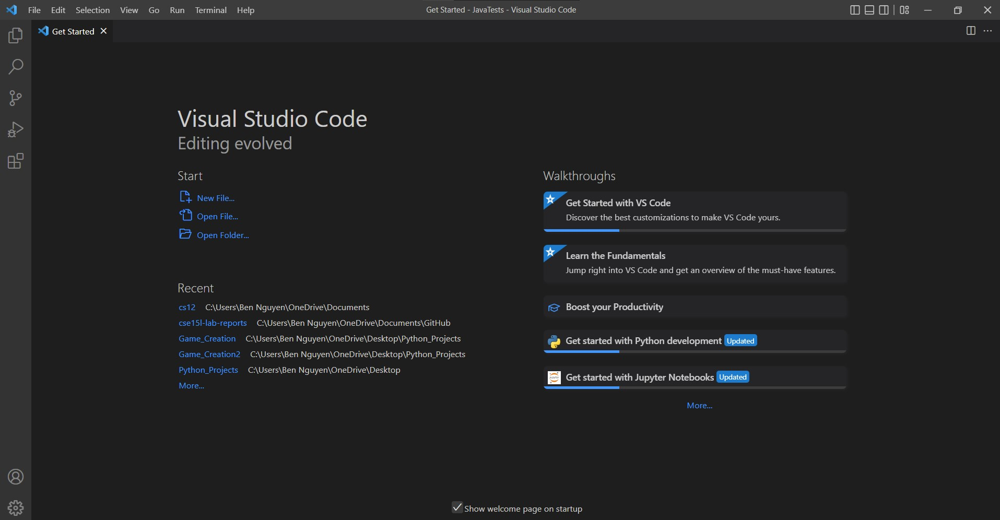

Week 1
# Lab 1: Remote Access
---
This lab is focused on creating an environment to work on tasks remotely using a remote server

## Part 1: Installing Visual Studio Vode
Download and install Visual Studio Code by clicking on this [link](https://code.visualstudio.com/)
Follow the instructions to install the appropriate version of Visual Studio Code (ie OSX or Windows).
Once VSCode is installed, you should be able to open it up and have it look similar to the screenshot
below.

