Week 3
# Week 3 Lab Report 2: Servers and Bugs
This lab was focused on creating a server on the localhost in addition to creating test cases and debugging given code

## Part 1: Simples Search Engine
The block of code below is the code used for the Simplest Search Engine for Week 2

```
import java.io.IOException;
import java.net.URI;
import java.util.ArrayList;

class Handler implements URLHandler {
    // The one bit of state on the server: a number that will be manipulated by
    // various requests.
    ArrayList StringList = new ArrayList<String>();

    public String handleRequest(URI url) {
        if (url.getPath().equals("/")) {
            return StringList.toString();
        } else if (url.getPath().equals("/addString")) {
            StringList.add("NewString");
            return String.format("String added!");
        } else {
            // Adding a String
            System.out.println("Path: " + url.getPath());
            if (url.getPath().contains("/adding")) {
                String[] parameters = url.getQuery().split("=");
                if (parameters[0].equals("s")) {
                    StringList.add((String)parameters[1]);
                    return "String: " + parameters[1] + " has been added";
                }
            }
            // Finding which Strings contain the query
            else if (url.getPath().contains("/find")) {
                String[] parameters = url.getQuery().split("=");
                if (parameters[0].equals("s")) {
                    ArrayList<String> returning = new ArrayList<String>();
                    for (int i = 0; i < StringList.size(); i++) {
                        String check = (String)StringList.get(i);
                        if (check.contains((String)parameters[1])) {
                            returning.add(check);
                        }
                    }
                    return returning.toString();
                }
            }
            return "404 Not Found!";
        }
    }
}

class SearchEngine {
    public static void main(String[] args) throws IOException {
        if(args.length == 0){
            System.out.println("Missing port number! Try any number between 1024 to 49151");
            return;
        }

        int port = Integer.parseInt(args[0]);

        Server.start(port, new Handler());
    }
}
```


The screenshots below are the results of the block of code above when given various inputs:


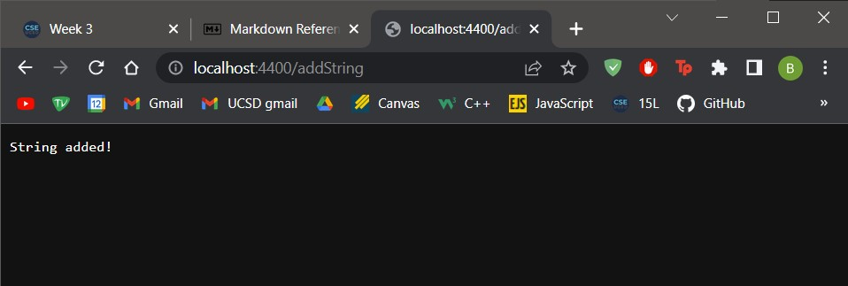

The screenshot above displays the result of the handleRequest method of the code above. To be more specific, the screenshot provides the output when `/addString` is added to the end of the url. Adding `/addString` to the path of the url adds the String "NewString" to an ArrayList of Strings. The member variable `StringList` is now updated to contain the String "NewString" as its first and only element.


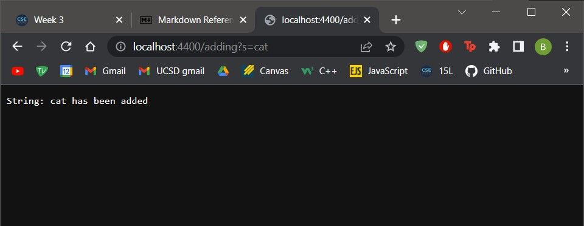

The screenshot above displays the result of the handleRequest method after adding to the end of the url `adding?s=cat`. The `adding` indicates to the method that the url is giving a query, which is indicated by the `?` in the url. The `s=` in the query indicates that the following characters will be added to the member variable `StringList` as another element in it. The output, or what is displayed on the server, is a message that indicates that the String, in this case "cat" has been added


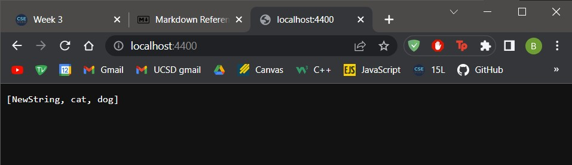

The screenshot above displays the member variable `StringList`. The list contains on the strings that haven been previously. In the screenshot provided, the String "dog" was added. This is the result of the handleRequest method when no extra lines are added to the url and just the original url is given.


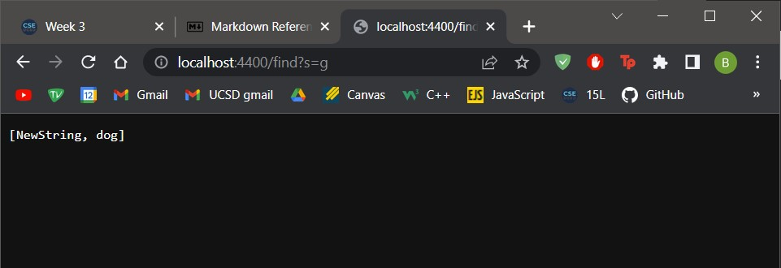

The screenshot above displays the result of the handleRequest method when the query `find` is used. With this query given, the input given, in this case "g", the handleRequest method looks through each element in the StringList member variabl and finds all Strings in it that contain a "g". In this case the output is "NewString" and "dog" because both strings contain a "g". The String "cat" is not included as it does not have a "g" in its string.

## Part 2: Test Cases and Bugs
**ArrayExamples.java**

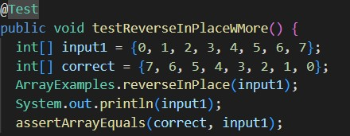

The screenshot above displays the failure-inducing input for the reverseInPlace method for the `ArrayExamples.java` file. The test checks if the method properly reversed an integer list with the elements `{0, 1, 2, 3, 4, 5, 6, 7}`

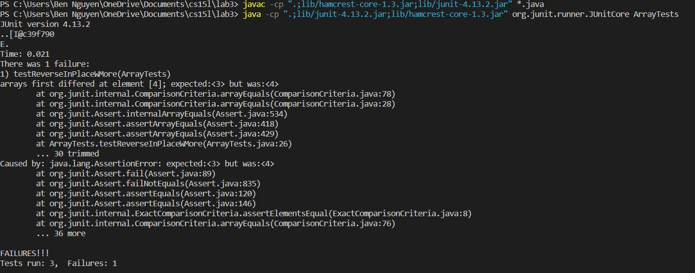

The screenshot above displays the symptom of the reverseInPlace method. From the symptom, the error seems to be that the method did not properly reverse the order of the list. The method was called on the integer list variable `input1`. However the output for the method did not properly reverse the list as it should be. The order of the list should follow the order in the integer list `correct`. From the symptom, it seems that the method had some sort of trouble at index 3 and index 4.

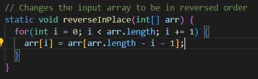

The screenshot above displays the method reverseInMethod. The specific bug was that the length of the for loop in the method was called to be length of the list when it should have been called for only half the length of the list. This causes an error where the first half of the list is reversed, but not the second half, which causes the list to be mirrored and not reversed. This happens because the last half is mirrored onto the first, but because the values of the list never changed and the for-loop runs for the length of the list, the elements that were reversed onto the first half are then reversed back onto the second half, causing no changes to appear in the second half.

In the error messaged seen in the symptom, it showed that there was only an error when it reached halfway through the list. This lines up with the logic of the bug because of how the length used in the bug causes the list to reverse up to the first half. Up until the first half of the list, the list is indeed reversed. However after it reaches the halfway points, due to how the elements from the now changed first half are reversed back onto the second half, the elements in the second half remain the same.

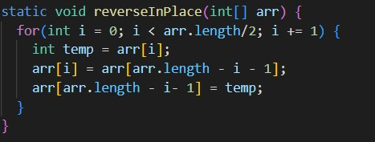

The screenshot above displays the fix to the bug. The size of the for loop was properly adjusted. Additionally, the variable `temp` was used in order to better keep track of the elements in the list and the line
 `arr[arr.length - i -1]] = temp` was added to handle reversing the other half of the list.


**LinkedListExamples.java**

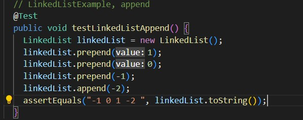

The screenshot above displays the failure-inducing input for the append method for the `LinkedListExamples.java` file. The test checks to see if the method properly appended an int `-2` to a LinkedList with 3 other elements already stored in the list.

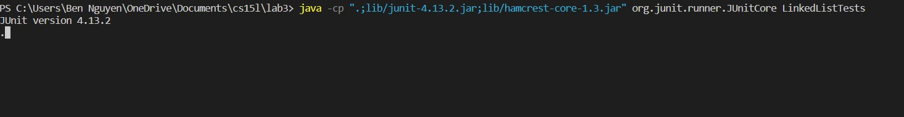

The screenshot above displays the symptom of the append method. From the symptom, it can be seen that the method seems to be stuck and therefore cannot produce an output. This is proven by the lack of the error messages from the terminal.

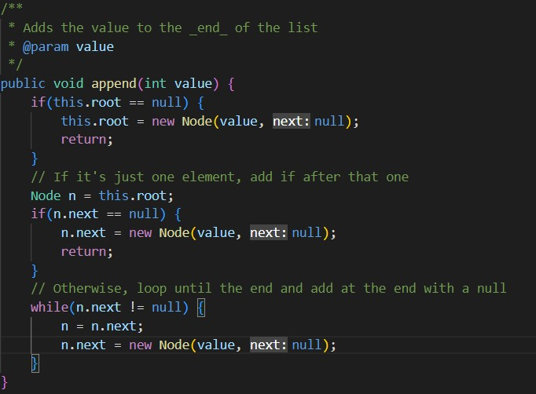

The screenshot above displays the append method. The specific location of the bug is in the while loop. This is where the code seems to be stuck. The issue this bug creates is that if there are already at least 2 elements in the LinkedList, the code moves to the while loop and never checks to append the value at the end of the list. Instead the method appends the value at index 2 and never breaks out of the loop.

This bug lines up with the symptom from the test case because in the test case, the program never reached in an end. This was caused by the bug that was stuck in the while-loop and had no way of breaking out. The program waited for the method to finish, but since the method was stuck, the output was also stuck. 

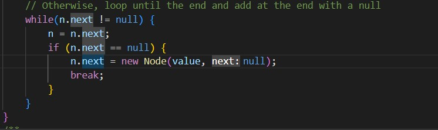

The screenshot above displays the fix to the bug. Since the issue with the bug was that it never waited for the while loop to reach the last element, an if-statement was added to make sure the last element was reached, and if it is reached, the value would be appended and a break statement would ensure that the while-loop was broken out of.
