Week 5
# Week 5 Lab Report 3: Researching Commands

## Part 1: Less
The `less` command allows the user to only look at a small portion of a file at a time. Instead of opening the whole file, the `less` command only displays one page of the file at a time. The following output displays the use of `less rr74.txt` command when in the `technical/biomed/` directory. This is useful if the file is too large to load all at once.
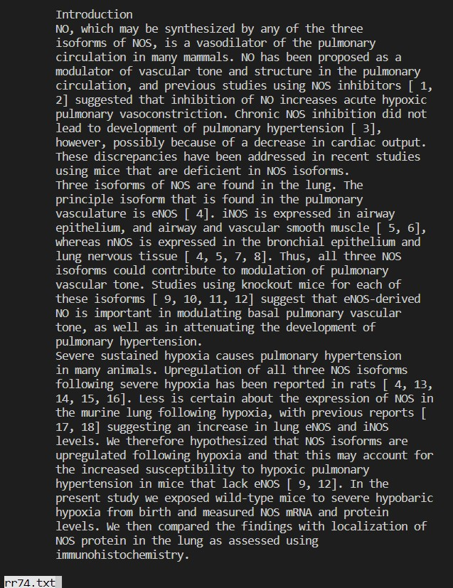

*`-N`*

In addition to displaying the contents of a file a page at a time, the `-N` command displays the line numbers of the file too. The following screenshot shows the output of the `less -N rr74.txt` command when in the `technical/biomed/` directory. This is useful to more clearly navigate through the file.
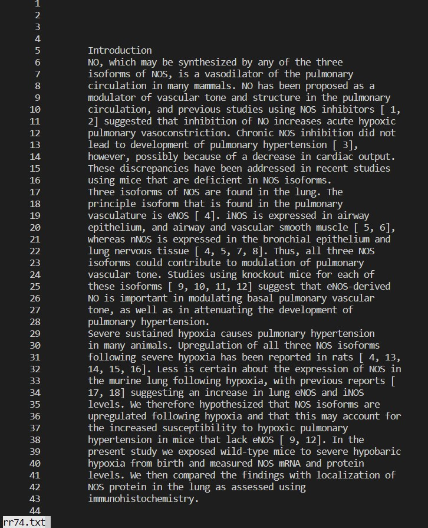

*`-X`*

In the command line, the `less` command also be used with `-X` in order to have the contents of the file remain in the terminal even after exiting the `less` command. (By default, when leaving the `less` command, the terminal will clear the contents of the command) The following screenshot shows the output of the `'less -X rr74.txt` command when in the `technical/biomed/` directory. This is convenient for the user to use instead of having to constantly open and close the file.
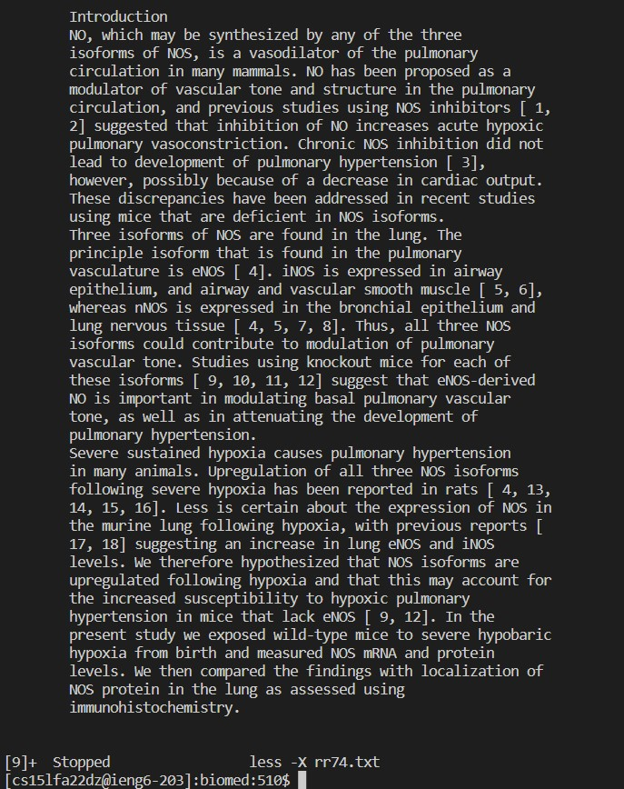

*`-p [pattern]`*

The `-p [pattern]` command-line option allows the `-less` command to jump to the first occurence of `pattern`. For example, the following screenshot shows the output when using the command `-less -p "however" rr74.txt` in the `technical/biomed/` directory. This is useful for the user as it allows them to quickly navigate to a specific location in the file.
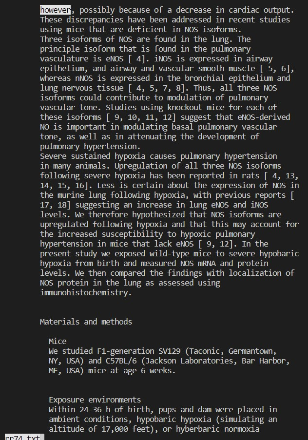

## Part 3: find
The `find` command allows the user to find all files and directories under their current directory. For example, the following screenshot is snippet of the output of the `find biomed` command when in the `technical` directory. This is useful because it allows the user to be aware of what directory they're in, and what directories are beneath it.
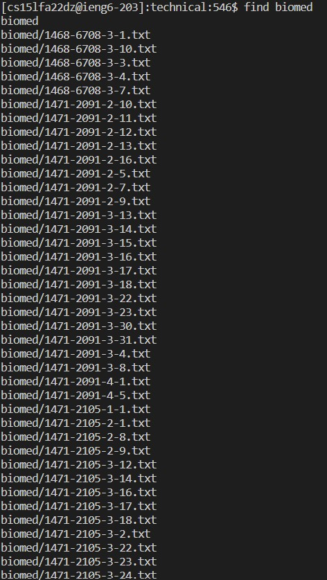

*`-maxdepth [number]`*

The `-maxdepth [number]` command-line option allows the user to control how many subdirectories/levels the command should go. For example, the following screenshot displays the output of the `find -maxdepth 1` command when in the `technical` directory. This is useful when the user only needs to be aware of a specific amount of directories, and not every subdirectory beneath them.
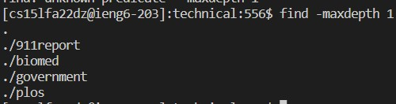

*`-empty`*

The `-empty` command-line option allows the user to find all directories that have no files or directories within it, as well as all empty files (contains nothing). For example, the following screenshot displays the output of the `find -empty` command after making and empty directory in the `technical` directory. This is useful because it allows the user to be aware of any files or directories that don't have any contents within them
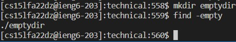

*`-newer`*

The `-newer` command-line option allows the user to find files that were either changed or created after the specified file. For example, the following screenshot displays a new file being created titled as `Hello.txt` in the `technical/biomed` directory. Afterwards, the command `find -newer rr74.txt` was used to produce the following output. This command is useful when the user wants to only look at more recent files.
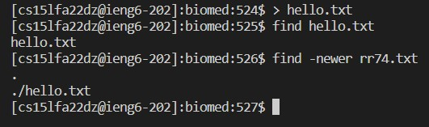

## Part 3: grep
The `grep` command allows users to search through a file to find a specified pattern in a line of the file. The command then displays the lines that contain the pattern. The following screenshot displays the output of the `grep "Mice" rr74.txt` when in the 'technical/biomed` directory. This command option is useful because it allows the user to quickly examine the contents of the file when looking for something in particular.
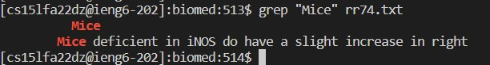

*`-i`*
The `-i` command-line option allows the user to search for the specified pattern without having to worry about case sensitivity of the pattern. For example, the following screenshot displays the output of the `grep -i "MICE" rr74.txt` command when in the `technical/biomed` directory. This command-line option is useful for when the user is not sure of the case sensitivity of the pattern that they are looking for.

*`-c`*
The `-c` command-line option allows the user to simply find the number of instances the grep command finds a match, displaying the number of matches instead of each case where there is a mtach. For example, the following screenshot displays the output of the `grep -c "mice" rr74.txt` command when in the `technical/biomed` directory. This command-line option is useful for when the user is not interested in the location of where grep matches, but simply the number of times grep finds a match.
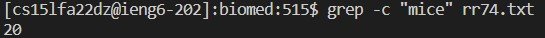

*`-n`*
The `-n` command-lien option allows the user to print the line number of where grep finds a match with its specified pattern. For example, the following screenshot displays the output of the `grep -n "mice" rr74.txt` command in the `technical/biomed` directory. This command-line option is useful for when the user wants to know the exact location of each match in the file.
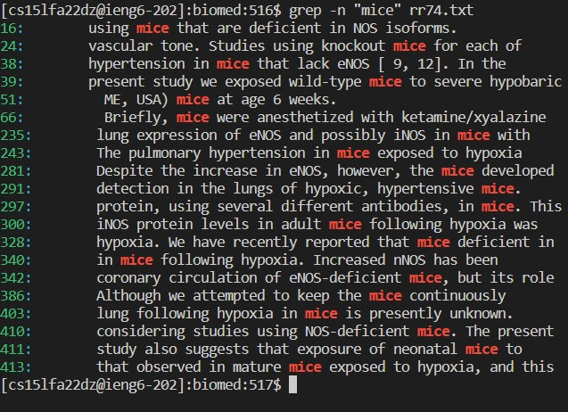