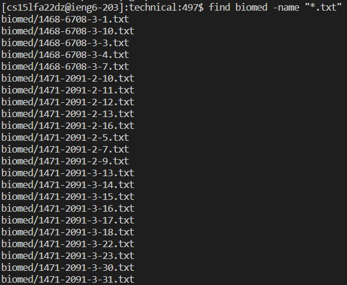

Week 5
# Week 5 Lab Report 3: Researching Commands

## Part 1: Less
The `less` command allows the user to only look at a small portion of a file at a time. Instead of opening the whole file, the `less` command only displays one page of the file at a time. The following output displays the use of `less rr74.txt` command when in the `technical/biomed/` directory. This is useful if the file is too large to load all at once.

*`-N`*

In addition to displaying the contents of a file a page at a time, the `-N` command displays the line numbers of the file too. The following screenshot shows the output of the `less -N rr74.txt` command when in the `technical/biomed/` directory. This is useful to more clearly navigate through the file.

*`-X`*

In the command line, the `less` command also be used with `-X` in order to have the contents of the file remain in the terminal even after exiting the `less` command. (By default, when leaving the `less` command, the terminal will clear the contents of the command) The following screenshot shows the output of the `'less -X rr74.txt` command when in the `technical/biomed/` directory. This is convenient for the user to use instead of having to constantly open and close the file.

*`-p [pattern]`*

The `-p [pattern]` command-line option allows the `-less` command to jump to the first occurence of `pattern`. For example, the following screenshot shows the output when using the command `-less -p "however" rr74.txt` in the `technical/biomed/` directory. This is useful for the user as it allows them to quickly navigate to a specific location in the file.

## Part 1: find
The `find` command allows the user to find all files and directories under their current directory. For example, the following screenshot is snippet of the output of the `find biomed` command when in the `technical` directory. This is useful because it allows the user to be aware of what directory they're in, and what directories are beneath it.

*`-maxdepth [number]`*

The `-maxdepth [number]` command-line option allows the user to control how many subdirectories/levels the command should go. For example, the following screenshot displays the output of the `find -maxdepth 1` command when in the `technical` directory. This is useful when the user only needs to be aware of a specific amount of directories, and not every subdirectory beneath them.

*`-empty`*

The `-empty` command-line option allows the user to find all directories that have no files or directories within it, as well as all empty files (contains nothing). For example, the following screenshot displays the output of the `find -empty` command after making and empty directory in the `technical` directory. This is useful because it allows the user to be aware of any files or directories that don't have any contents within them

*`-name [pattern]`*

The `-name [pattern]` command-line option allows the user to find all files that match the specified. For example, the following screenshot displays the output of the `find biomed -name ".txt"` command when in the `technical` directory. This command option is usefule because it helps the user find all files the whose filename follow a specific pattern

## Part 1: grep