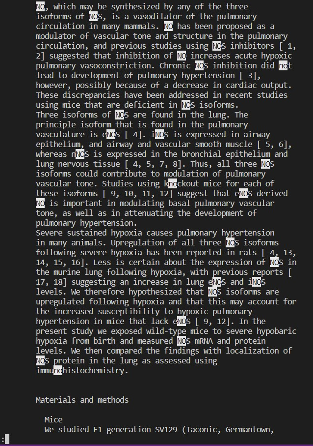

Week 5
# Week 5 Lab Report 3: Researching Commands

## Part 1: Less
The `less` command allows the user to only look at a small portion of a file at a time instead of opening the whole file. Once viewing a file through the `less` command, the command will allow additional inputs to look through the file more efficiently or make adjustments to it.The following output displays the use of `less rr74.txt` command when in the `technical/biomed/` directory. This is useful if the file is too large to load all at once.

*`-X`*
In the command line, the `less` command can be used with `-X` in order to have the contents of the file remain in the terminal even after exiting the `less` command. (By default, when leaving the `less` command, the terminal will clear the contents of the command) 

1)
The following screenshot shows the output of the `'less -X rr74.txt` command when in the `technical/biomed/` directory. The command opens the `rr74.txt` file and leaving the file in the terminal when the user is done looking at the file. This is convenient for the user to use instead of having to constantly open and close the file.

2)
The follwoing screenshot shows the output of the command `grep "mice" rr74.txt > hello.txt | less -X hello.txt` when in the `technical/biomed/` directory. The `-X` option allows the user to keep the output of the `grep` command in the terminal in case the user needs to look at the output of the modified file in the terminal. This shows how the `-X` command-line option can be useful when used in combination with other commands.

3)
The following screenshot shows the output of the `less -X rr74.txt` command when in the `technical/biomed/` directory, however the input `q` was given after a section of the file was reached. This is useful for the user when the user only wants to keep a certain part of the file in the terminal open instead of the whole file.

*`-p [pattern]`*

The `-p [pattern]` command-line option allows the `-less` command to jump to the first occurence of `[pattern]`. 

1)
The following screenshot shows the output when using the command `less -p "however" rr74.txt` in the `technical/biomed/` directory. The command is searching through the file and openeing the file starting at the first instance of `[pattern]`. This is useful for the user as it allows them to quickly navigate to a specific location in the file.

2)
The following screenshot shows the output of the command `less -p "Materials" -X -rr74.txt` when in the `technical/biomed/` directory. The command searches the file for the specified pattern and opens the file at that location. Afterwards, when the user is finished looking at the file, the file will stay in the terminal. The use of both `-p` and `-X` is useful because it allows the user to only grab a certain part of a long file if they know what section they want to keep in their terminal.

3)
The following screenshot shows the output of `less -p "Material" -N rr74.txt` command when in the `technical/biomed` directory. The command searches through the file for the first instance of the pattern and numbers the line where the file is starting at. The use of the `-p` command-line option with `-N` because it allows the user to be aware of where they are in a file once the open the file at the location they want.

*`-i`*

The `-i` command-line option allows searches done with the file to ignore the case of the search

1)
The following screenshot shows the output of the `less -i rr74.txt` command, and then the input of `/no` to search for any instance of "no" in the file while ignoring the case of the characters in "no", when in the `technical/biomed` directory. The command opens the file with the `less` command and allows the user to give inputs while in a special view of the file to make adjustments are look through the file more efficiently. However, with the `-i` command-line option, the search will ignore the case of the pattern. This is useful to the user when they want to search for something specific in the file without having to worry about the case of their search.

2)
The following screenshot shows the outut of the `less -i -p "introduction" rr74.txt` command when in the `technical/biomed` directory. The command searches and opens the file at the first instance of the pattern while ignoring the case ofthe pattern. This command is useful when used with the `-p` command because the search of the `-p` command will also ignore cases.

3)
The following screenshot shows the output of the `less -i -X -p "conclusion" rr74.txt` command when in the `technical/biomed` directory. The command shows how the `-i` command-line option can be used with any command, in particular the example shows how the command-line option could be used with the other 2 command-line options shows before. The command specifically shows how a user could keep a certain section of a file in the terminal after ignoring the case of the search, but the example is meant to show how flexible the `-i` option is and how it could be used inconjunction with other commands to create a braoder search for something within the file.
