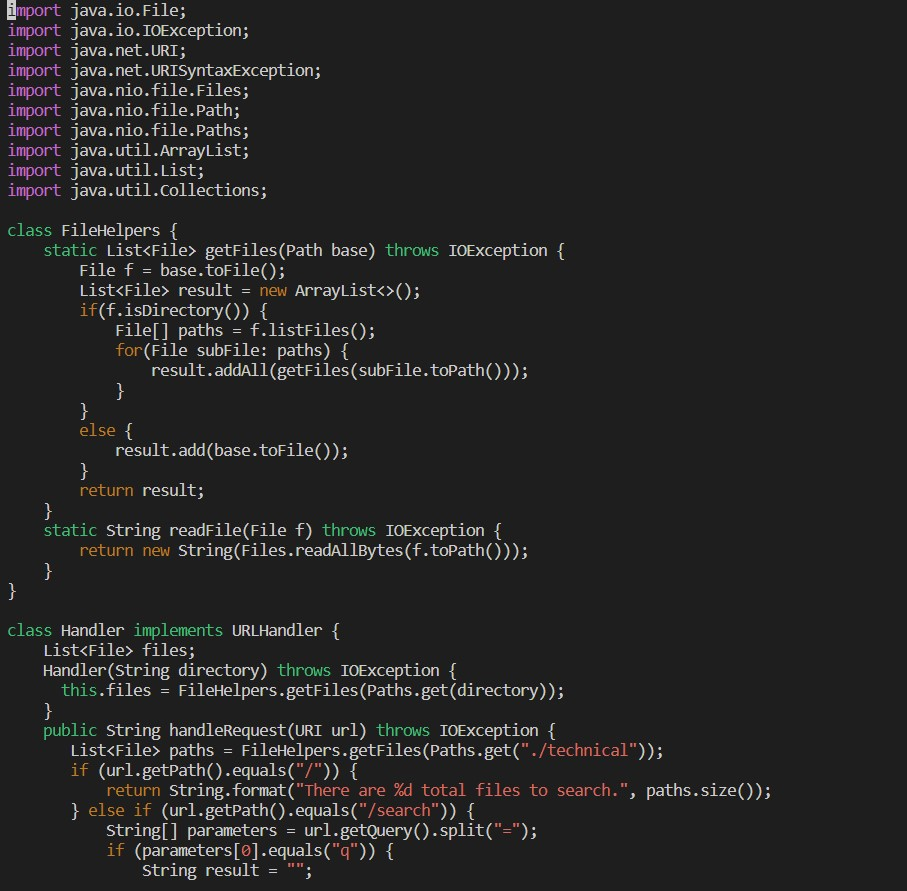
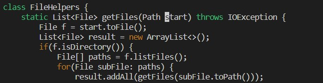
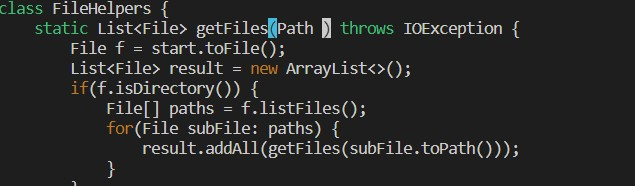
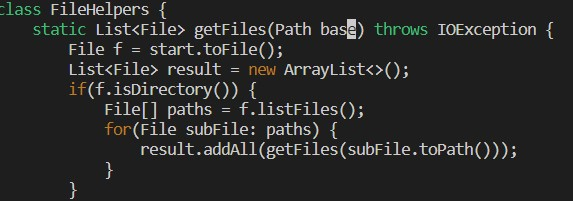
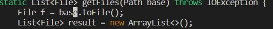
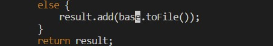
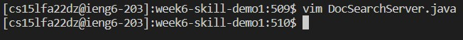

Week 7
# Week 7 Lab Report

## Part 1 

*Instructions for First Task*
Second Task:
In `DocSearchServer.java`, change the name of the `start` paraneter of `getFiles`, and of its uses, to instead be called `base`.

Instructions: (Starting in `week6-skill-demo1` directory)
1. `vim D` `<tab>` `<Enter>`
2. `/star` `<Enter>`
3. `ce`
4. `base` `<esc>`
5. `n.`
6. `n.`
7. `:wq` `<Enter>`

1. `vim D` `<tab>` `<Enter>`

The screenshot displays the `DocSearchServer.java` file opened up in vim.

2. `/star` `<Enter>`

The screenshot displays the first letter instance of the first letter of `start` being highlighted

3. `ce` 

The screenshot displays the word `start` being deleted

4. `base` `<esc>`

The screenshot displays the word `start` being replaced by `base`

5. `n.`

The screenshot displays vim searching and replacing the next instance of `start` with `base`

6. `n.`

The screenshot displays vim searching and replacing the next instance of `start` with `base`

7. `:wq` `<Enter>`

The screenshot displays vim saving and exiting the file and going back to the terminal