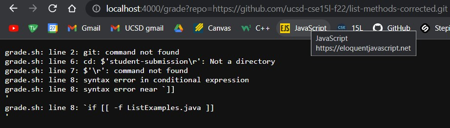

Week 8
# Week 9 Lab Report 

## Part 1

The following block of code is my grade.sh file
```
rm -rf student-submission
git clone $1 student-submission
cp TestListExamples.java student-submission
cp lib/hamcrest-core-1.3.jar student-submission
cp lib/junit-4.13.2.jar student-submission
cd student-submission

if [[ -f ListExamples.java ]]
then 
    echo "ListExamples.java File was found"
else 
    echo "[FAILED] 0/5 tests passed"
    echo "ListExamples.java file is not found"
    exit
fi

javac -cp ".;hamcrest-core-1.3.jar;junit-4.13.2.jar" TestListExamples.java 2> error.txt > output.txt

if [[  $? -eq 0  ]]
then
    echo "file was compiled"
else
    echo "[FAILED] 1/5 tests passed"
    echo "file was not compiled"
    cat error.txt
    exit
fi

java -cp ".;hamcrest-core-1.3.jar;junit-4.13.2.jar" org.junit.runner.JUnitCore TestListExamples 2> RuntimeError.txt > RuntimeOutput.txt
if [ $? -eq 0 ]
then
    echo "[PASSED] 5/5 tests passed"
    exit
else
    echo "at least 2/5 tests passed"
    echo "[FAILED] at least 1 test (total 3)"
    cat RuntimeOutput.txt
    exit
fi
```

I was unfortunately not able to run the GradeServer.java file appropriately on the server, even when running the `java GradeServer 4000` on Git Bash. The following screenshot is the result of running the command on Git Bash, and using `https://github.com/ucsd-cse15l-f22/list-methods-corrected.git` as the query on Windows. I have also tried running the GradeServer on my `ssh` account but reached a similar issue


The following three screenshots are the results of the `grade.sh` file being run on my local desktop and their reported grade.

Example 1: `https://github.com/ucsd-cse15l-f22/list-methods-corrected.git`


Example 2: `https://github.com/ucsd-cse15l-f22/list-methods-lab3.git`


Example 3: `https://github.com/ucsd-cse15l-f22/list-methods-compile-error.git`


## Part 2
Tracing `grade.sh` for Example 1
Student submission:

`https://github.com/ucsd-cse15l-f22/list-methods-corrected.git`


Line 1: `rm -rf student-submission`

removes all files in student-submission and the directory itself

* Standard Output: [blank]

* Standard Error: [blank]

* Return Code: 0

Line 2: `git clone $1 student-submission`

Clones the given student submission into a directory called `student-submission`

* Standard Output: [blank]

* Standard Error:

        `Cloning into 'student-submission'...`

* Return Code: 0

Line 3: `cp TestListExamples.java student-submission`

Copies over the `TestListExamples.java` file into `student-submission`

* Standard Output: [blank]

* Standard Error: [blank]

* Return Code: 0

Line 4: `cp lib/hamcrest-core-1.3.jar student-submission` 

Copies over `lib/hamcrest-core-1.3.jar` into `student-submission` in order to run jUnit tests

* Standard Output: [blank]

* Standard Error: [blank]

* Return Code: 0

Line 5: `cp lib/junit-4.13.2.jar student-submission`

Copies over `lib/junit-4.13.2.jar` into `student-submission` in order to run jUnit tests

* Standard Output: [blank]

* Standard Error: [blank]

* Return Code: 0

Line 6: `cd student-submission`

Changes current directory to `student-submission`

* Standard Output: [blank]

* Standard Error: [blank]

* Return Code: 0

Line 8: `if [[ -f ListExamples.java ]]`

* The condition was true. In this line, the command is determining whether or not the `ListExamples.java` was in the student submission, and whether or not the file was submitted in the appropriate directory in the submission. Since in this example the student submitted the file and the file was in the approrpiate directory, the condition of this statement was true

Line 9: `then`

* Indicates to the script to run the next section of code since the if statement's condition was true

Line 10: `echo "ListExamples.java File was found"`

Prints out the statement `ListExamples.java File was found` in the terminal

* Standard Output: 

        `ListExamples.java File was found`

* Standard Error: [blank]

* Return Code: 0

Lines 11-14:
```
else 
    echo "[FAILED] 0/5 tests passed"
    echo "ListExamples.java file is not found"
    exit
```
* This block of code did not run because the if statement's condition in line 8 was true

Line 15: `fi`

* Closes the if statement

Line 17: `javac -cp ".;hamcrest-core-1.3.jar;junit-4.13.2.jar" TestListExamples.java 2> error.txt > output.txt`

Compiles the `TestListExamples.java` file and directs the standard error to `error.txt` and the standard noutput to `output.txt`

* Standard Output: [blank]

* Standard Error: [blank]

* Return Code: 0

Line 19: `if [[  $? -eq 0  ]]`

* The condition was true. This if statement determines whether or not the return code of the previous command (`javac -cp ".;hamcrest-core-1.3.jar;junit-4.13.2.jar" TestListExamples.java 2> error.txt > output.txt`) was 0 or not. Since the return code of the command was 0 (the code successfuly compiled without any compiler errors), the condition is true

Line 20: `then`

* Indicates to the script to run the next section of code since the if statement's condition was true.

Line 21: `echo "[FAILED] file was compiled"`

Prints out the statement `file was compiled` in the terminal

* Standard Output: 

        `file was compiled`

* Standard Error: [blank]

* Return Code: 0

Lines 22-26:
```
else
    echo "[FAILED] 1/5 tests passed"
    echo "file was not compiled"
    cat error.txt
    exit
```
* This block of code did not run because the if statement's condition in line 19 was true.

Line 27: `fi`

* Closes the if statement

Line 29: `java -cp ".;hamcrest-core-1.3.jar;junit-4.13.2.jar" org.junit.runner.JUnitCore TestListExamples 2> RuntimeError.txt > RuntimeOutput.txt`

Runs the `TestListExamples.java` file and directs the standard error to `RuntimtError.txt` and standard outut to `RuntimeOutput.txt`

* Standard Output:
```
[JUnit version 4.13.2

...

Time: 0.039

OK (3 tests)]
```

* Standard Error: [blank]

* Return Code: 0

Line 30: `if [ $? -eq 0 ]`

* The condition was true. This if statement determines whether or not the return code of the previous command (`javac -cp ".;hamcrest-core-1.3.jar;junit-4.13.2.jar" TestListExamples.java 2> error.txt > output.txt`) was 0 or not. Since the return code of the command was 0 (the code successfuly ran without any runtime errors), the condition is true

Line 31: `then`

* Indicates to the script to run the next section of code since the if statement's condition was true.

Line 32: `echo "[PASSED] 5/5 tests passed"`

Prints out the statement `[PASSED] 5/5 tests passed` in the terminal

* Standard Output: 

        `[PASSED] 5/5 tests passed`

* Standard Error: [blank]

* Return Code: 0

Line 33: `exit`

Terminates the grade.sh script and exits it

* Standard Output: [blank]

* Standard Error: [blank]

* Return Code: Non 0 exit code

Lines 34-39:
```
else
    echo "at least 2/5 tests passed"
    echo "[FAILED] at least 1 test (total 3)"
    cat RuntimeOutput.txt
    exit
```
* This block of code did not run because the if statement's condition in line 30 was true. Additionally, line the 33 exited the bash script and therefore prevented the script from running the rest of the file


